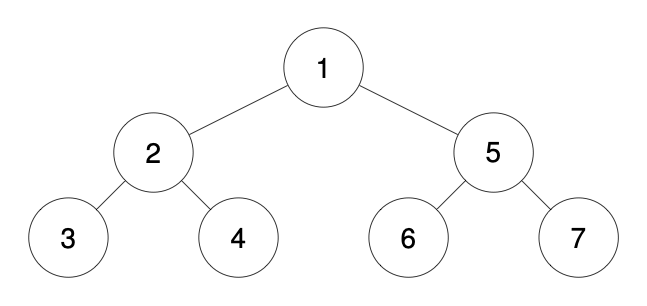
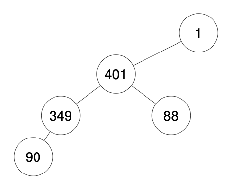

# 1028. Recover a Tree From Preorder Traversal

**`Hard`**
Topics
C
We run a preorder depth-first search (DFS) on the root of a binary tree.

At each node in this traversal, we output D dashes (where D is the depth of this node), then we output the value of this node.  If the depth of a node is D, the depth of its immediate child is D + 1.  The depth of the root node is 0.

If a node has only one child, that child is guaranteed to be the left child.

Given the output traversal of this traversal, recover the tree and return its root.

 

### Example 1:


**Input:** traversal = "1-2--3--4-5--6--7"

**Output:** [1,2,5,3,4,6,7]

### Example 2:


**Input:** traversal = "1-2--3---4-5--6---7"

**Output:** [1,2,5,3,null,6,null,4,null,7]

### Example 3:


**Input:** traversal = "1-401--349---90--88"

**Output:** [1,401,null,349,88,90]

 

### Constraints:

- `The number of nodes in the original tree is in the range [1, 1000].`
- `1 <= Node.val <= 109`

### Solution

```go
type TreeNode struct {
	Val   int
	Left  *TreeNode
	Right *TreeNode
}

// Função principal para reconstruir a árvore
func recoverFromPreorder(traversal string) *TreeNode {
	if len(traversal) == 0 {
		return nil
	}

	// Pilha para armazenar os nós e suas profundidades
	stack := []*TreeNode{}
	i := 0

	// Função para obter o valor do nó
	getValue := func() int {
		start := i
		for i < len(traversal) && traversal[i] != '-' {
			i++
		}
		val, _ := strconv.Atoi(traversal[start:i])
		return val
	}

	// Função para obter a profundidade do nó
	getDepth := func() int {
		depth := 0
		for i < len(traversal) && traversal[i] == '-' {
			depth++
			i++
		}
		return depth
	}

	// Criar o nó raiz
	root := &TreeNode{Val: getValue()}
	stack = append(stack, root)

	for i < len(traversal) {
		depth := getDepth()
		value := getValue()

		node := &TreeNode{Val: value}

		// Enquanto a profundidade do nó atual for menor ou igual à profundidade do topo da pilha, desempilhe
		for len(stack) > depth {
			stack = stack[:len(stack)-1]
		}

		// Adicionar o nó como filho esquerdo ou direito do nó no topo da pilha
		if stack[len(stack)-1].Left == nil {
			stack[len(stack)-1].Left = node
		} else {
			stack[len(stack)-1].Right = node
		}

		// Empilhar o novo nó
		stack = append(stack, node)
	}

	return root
}

// Função auxiliar para imprimir a árvore em pré-ordem (para teste)
func printPreOrder(root *TreeNode) {
	if root == nil {
		return
	}
	fmt.Printf("%d ", root.Val)
	printPreOrder(root.Left)
	printPreOrder(root.Right)
}
```

### Test

```go
func main() {
	testCases := []struct {
		input string
	}{
		{input: "1-2--3--4-5--6--7"},
		{input: "1-2--3--4-5--6--7-8--9--10--11--12--13--14--15--16--17--18--19--20--21--22--23--24--25--26--27--28--29--30--31--32--33--34--35--36--37--38--39--40--41--42--43--44--45--46--47--48--49--50"},
	}
	for _, testCase := range testCases {
		fmt.Println("INPUT:", testCase.input)
		fmt.Printf("OUTPUT: %v\n\n", recoverFromPreorder(testCase.input))
	}
}

```